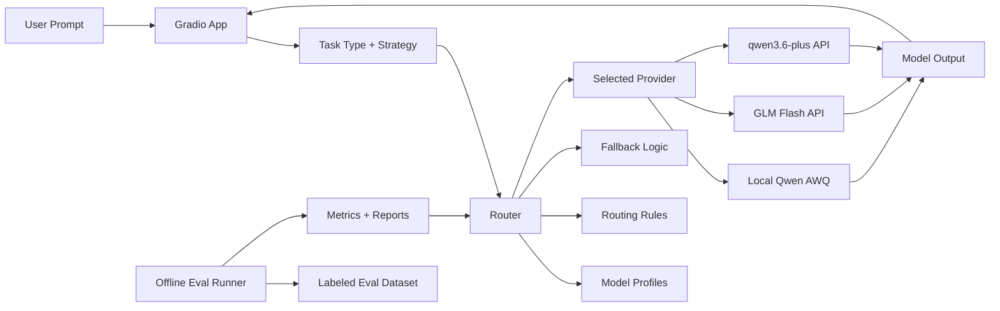

# Multi-Model Evaluation and Routing Platform

An MVP for AI platform / MaaS scenarios, focused on one practical question:

`When a platform has both local and remote LLMs available, how should it evaluate them and route each task to a better-fit model?`

This repository showcases:

- unified access to local and remote LLMs
- offline evaluation with a labeled dataset
- task-aware routing with strategy preferences
- fallback and retry / backoff for stability
- a simple Gradio demo for explainable routing decisions

## Why This Project Exists

In real AI platform scenarios, a single model rarely optimizes all of these at once:

- quality
- latency
- cost
- stability
- controllability

This project turns that tradeoff into a runnable MVP instead of a slide-only idea.

## What Is Included

- local model access via `Qwen2.5-7B-AWQ`
- remote model access via OpenAI-compatible APIs
- `50` labeled evaluation cases across `qa`, `summary`, `structured_extraction`, and `rewrite`
- lightweight V2 scoring with quality, format, and penalty signals
- routing strategies for `balanced`, `quality`, `latency`, and `cost`
- routing explanations visible in the demo UI

## Architecture



## Sample Results

Sample metrics from a 50-case run:

| Model | Avg Score | Avg Latency (ms) | Success Rate |
| --- | ---: | ---: | ---: |
| `qwen_local_awq` | 0.748 | 8439.1 | 1.00 |
| `zhipu_glm_flash` | 0.782 | 13207.1 | 0.74 |
| `aliyun_qwen36_plus` | 0.869 | 20558.7 | 1.00 |

Observed routing implications from the sample run:

- local AWQ was strong on low-cost and structured scenarios
- `qwen3.6-plus` had the highest average quality score
- `GLM-4.7-Flash` sat between quality and latency, but had lower stability in this run

See:

- [docs/results.md](docs/results.md)
- [reports/sample_metrics_summary.json](reports/sample_metrics_summary.json)

## Repository Structure

```text
multi-model-eval-router-platform/
├─ app.py
├─ config.py
├─ eval_runner_v2.py
├─ models.py
├─ providers_v2.py
├─ router.py
├─ requirements.txt
├─ .env.example
├─ data/
│  ├─ eval_dataset.json
│  └─ README.md
├─ docs/
│  ├─ project_overview.md
│  ├─ demo_script.md
│  └─ results.md
└─ reports/
   ├─ .gitkeep
   └─ sample_metrics_summary.json
```

## Quick Start

### 1. Install dependencies

```bash
pip install -r requirements.txt
```

### 2. Configure environment variables

Copy `.env.example` and fill in the values you need.

Key options:

- `LOCAL_QWEN_AWQ_PATH`
- `ZHIPU_API_KEY`
- `ZHIPU_BASE_URL`
- `ZHIPU_MODEL_NAME`
- `QWEN_API_KEY`
- `QWEN_BASE_URL`
- `QWEN_MODEL_NAME`

### 3. Run the demo

```bash
python app.py
```

Then open:

```text
http://127.0.0.1:7861
```

### 4. Run offline evaluation

```bash
python eval_runner_v2.py
```

Reports are written to:

```text
reports/
```

## Demo Flow

Recommended demo order:

1. `qa + quality`
2. `summary + balanced`
3. `structured_extraction + cost`
4. `rewrite + quality`

Detailed script:

- [docs/demo_script.md](docs/demo_script.md)

## Design Notes

- This is not a benchmark project in the academic sense.
- It is a product-facing evaluation and routing MVP.
- The goal is to make model selection more explainable and less subjective.

More context:

- [docs/project_overview.md](docs/project_overview.md)
- [docs/openclaw_pitch.md](docs/openclaw_pitch.md)
- [docs/application_materials.md](docs/application_materials.md)

## Notes

- This public version does not include model weights.
- This public version does not include private API keys.
- For local model usage, set `LOCAL_QWEN_AWQ_PATH` to your own model directory.
- Sample metrics are included for review; your own runs may differ by hardware, model version, and provider stability.

## License

This project is licensed under the MIT License. See [LICENSE](LICENSE).
